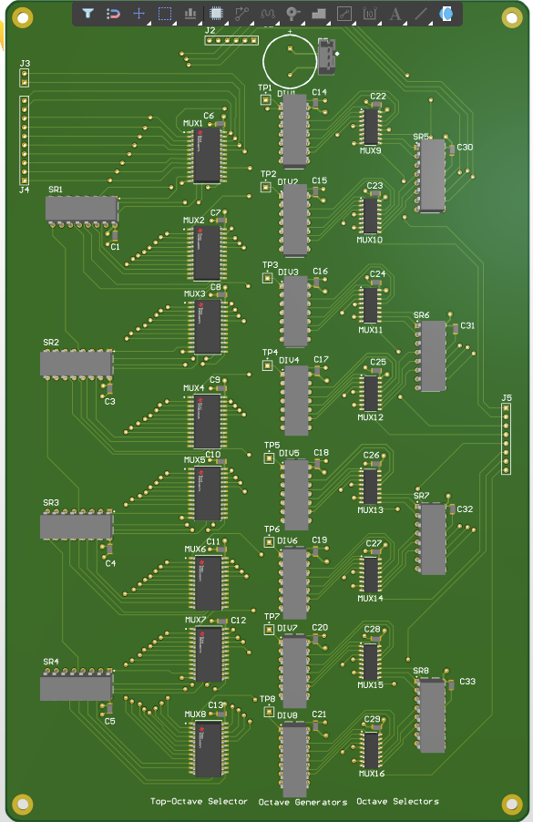
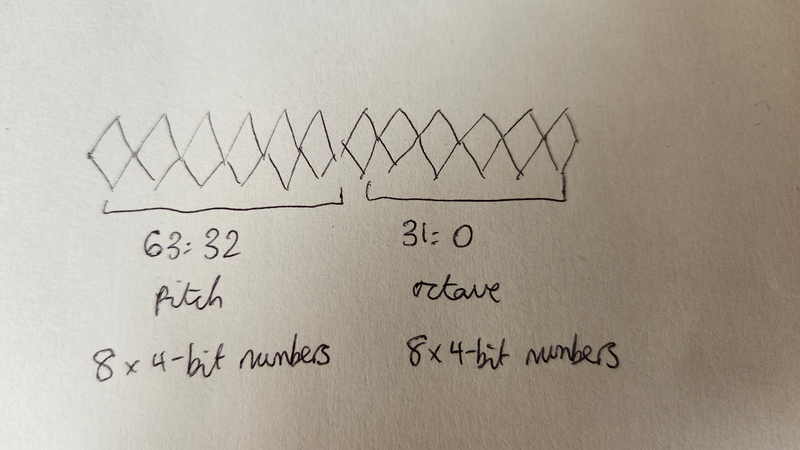

# Custom FPGA Divider-Keyer and Voice Assigner

A **divider-keyer** is a device used in polyphonic analogue synthesisers of the 1970s/80s. It can be thought of as the "brain" of a synthesiser, choosing which of the synthesiser's notes should be switched on or off depending on what the user plays on the keyboard. Divider-keyers often workiin tandem with a **voice** **assigner.** A voice assigner uses priority encoding logic  to select which notes should be passed to the synthesiser's processing stages (the voltage controlled amplifier, filters and effects).

This is a working prototype of a combined divider-keyer and voice assigner written in SystemVerilog, tested on an Altera DE2 FPGA development board. The code and pin assignment files can be adapted to work with any FPGA, but you should have an absolute minimum of 23 GPIO inputs. I used the Quartus II v13.0 development environment, which was deprecated over 10 years ago, as it's the last version of Quartus that supports the Cyclone II on my board.

Some the most famous divider-keyer ICs include the **S10430** manufactured by AMI Semiconductor (now part of onsemi), used in the Korg Lambda and Roland RS-09. These monstrous 40-pin DIP ICs consist of a set of frequency dividers and transistors configured as switches to provide up to 4 voices of polyphony (that is, four different frequency waveforms). Even at the time of release, these were specialist ICs and not really very commercially available. They're even rarer now, with single chips often costing over £100. My pockets aren't that deep, so a single IC replacement wasn't feasible.

For my next idea, I turned to Altium Designer to design a PCB and schematic for this divider-keyer using a set of multiplexers and frequency dividers. This took a long time to lay out, and with this being a 4-layer board nearly the size of an A4 sheet of paper, came with a rather hefty price tag too. It looks scary, but it's really just eight copies of the same circuit, one for each output voice.

As I was designing this circuit, I kept thinking to myself, "This is a circuit that could be parallelised really easily". And there's no better way to make prototype circuits that require lots of parallelism than an FPGA.

I was a little hesitant on using an FPGA for this project to stay authentic to the physical, tangible analogue world, but after an intense internal monologue (and unfortunately, many wasted hours), I decided to follow through with it. And wow, I didn't anticipate how much I would learn, and still am learning, from this project about FPGAs.

### About the design - an overview

This project uses an FPGA to generate all 75 notes of a seven-octave piano keyboard from a 12-output "top octave" oscillator. The divider-keyer selects which notes should be passed to the eight output voices, controlled by a 64-bit SPI instruction encoding the pitch and octave of each desired output voice. The SPI instruction isn't produced on the FPGA itself, it comes from a microcontroller configured as a MIDI receiver. The project for this is also here on github. ([github.com/charlietheobald/midi-receiver-ongakucircuits](https://github.com/charlietheobald/midi-receiver-ongakucircuits))

**Inputs:** 12 top-octave generator output waveforms 3.3V LVTTL (one set of 12 waveforms required per oscillator); 64-bit SPI word at 1MHz from a microcontroller

**Outputs:** Waveforms of the 8 highest-priority waveforms, as determined by the SPI word.

The SPI receiver (**spireceiver.sv**) acts as the FPGA's SPI interface, and runs at 1MHz. Once a complete SPI message is received, this is split into two 32-bit words **pitchData** and **octaveData.**

* pitchData consists of eight 4-bit binary numbers 0-11, which select which of the 12 top octave generator inputs is selected for each voice. Of course, on a piano keyboard, the same pitch can be played across different octaves at the same time, so separate voices can have the same pitch data. The binary number 15 is used to force a high-impedance state, where none of the pitches are selected. Any note which is not being played will have pitchData of 15 (1111).
* octaveData consists of eight 4-bit binary numbers 0-6, which are fed into the frequency dividers to select how many octaves to divide the pitch down by. Again, different pitches can be played in the same octave, so separate voices can also have the same octave data. The binary number 15 is used to force a high-impedance state, where no octave is selected. Any note which is not being played will have pitchData of 15 (1111).

  Each 32-bit word has voice 7 (the lowest priority) in the most significant 4 bits, and voice 0 (the highest priority) in the least significant 4 bits.

  If an improvement in bits / speed is required, octaveData could be encoded using 3-bit binary numbers instead, the reason I have left octaveData as 4 bits is for simpler debugging and consistency with pitchData. I tested with 3 bits, the SPI transmission rate is fast enough that there is genuinely zero difference in user experience between 3 and 4 bits.

pitchData and octaveData, the 12 top octave waveforms, and a confirmation that the SPI transmission has been successful, are fed into the divider-keyer module **dividerkeyer.sv**. dividerkeyer.sv itself contains submodules that are emulations of common chips, like the CD4067 16:1 multiplexer (used for selecting pitch / octave) and the CD4024 (the frequency dividers).

### Testing

This implementation has been fully tested with over 200 input combinations using a custom testbench (of which a template is provided in this repo if you want to build one yourself), and the ModelSim simulator. I've tested quite a few odd edge cases, if you notice anything that needs changing, please let me know :)
